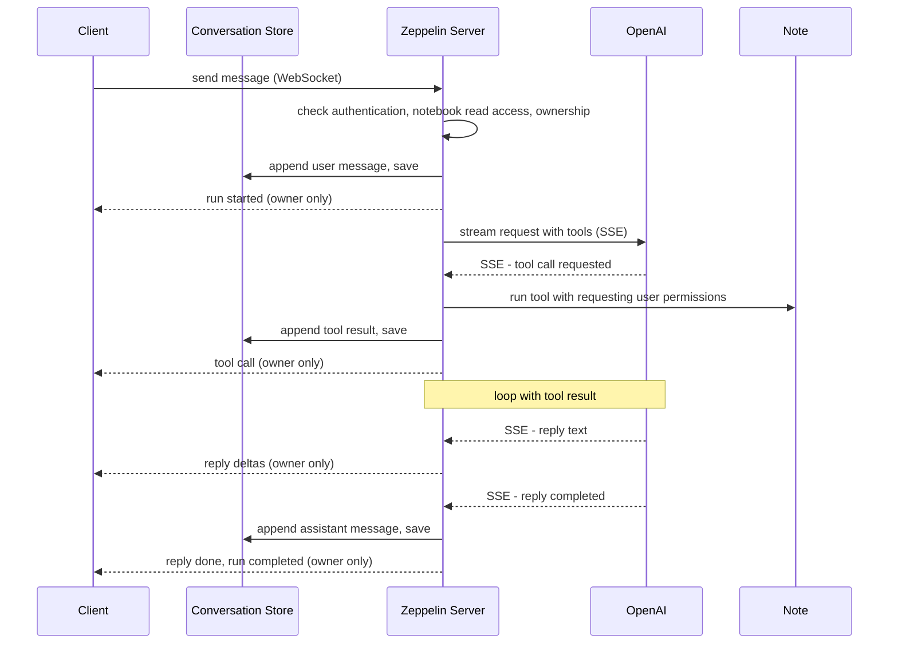

<!--
Licensed under the Apache License, Version 2.0 (the "License");
you may not use this file except in compliance with the License.
You may obtain a copy of the License at

http://www.apache.org/licenses/LICENSE-2.0
-->

# Notebook Assistant Proposal

## Overview

Add AI chat inside a notebook. Each notebook can hold multiple conversations,
and each conversation belongs to exactly one notebook and one authenticated user.
Conversation data is stored separately from notebook data. The assistant can
read the notebook context through tools, so it answers questions grounded in the
paragraphs and code the user is working on.

## Motivation

Users already ask an AI for help while working in a notebook — to explain code,
summarize a result, or decide the next step. But that happens in a separate
chat window, where the AI cannot see the notebook. The user copies code back and
forth, and the conversation is lost the moment the tab closes.

An assistant built into the notebook removes both gaps: it reads the paragraphs
and code directly through tools, and the conversation is persisted separately
while remaining linked to the notebook.

## Architecture

```
Browser (Angular)
    │  REST (conversation CRUD + history)  +  WebSocket (send + streaming)
    ▼
Zeppelin Server
    ├── REST APIs                      conversation CRUD, message history
    ├── NotebookServer (WS)            receive send, deliver owner-only run events
    └── NotebookAssistantService       run loop, per-note lock
          ├── ConversationStore        separate conversation storage
          ├── ToolExecutor             in-process tool registry
          └── ChatModel                provider-neutral streaming interface
                └── OpenAiChatModel    OpenAI adapter
    ▼
OpenAI
```

Key decisions:

- **Separate storage**: Conversations reference a notebook by `noteId` and are
  persisted outside its paragraphs and `.zpln` payload. Notebook exports and
  clones do not include conversation data. Cleanup when a notebook is deleted
  is deferred.
- **Easy creation**: Any authenticated user with read access to a notebook can
  start a conversation without notebook write permission. A notebook and a user
  can each have multiple conversations. The server assigns `ownerId` from the
  authenticated identity; anonymous users cannot create conversations.
- **Shared list, private conversations**: All users with read access to the
  notebook can see conversation summaries (`id`, `noteId`, `ownerId`, `title`,
  `createdAt`, `updatedAt`). Messages and previews are excluded. Only the owner
  can read the content, send messages, change the title when supported, or delete
  the conversation. Notebook read access is also required for these operations.
- **Streaming over WebSocket**: Sending a message and streaming the reply use the
  existing notebook WebSocket. Run events are delivered only to the owner,
  never broadcast to other notebook viewers.
- **Provider-neutral**: Only the OpenAI adapter is coupled to the provider.
  Everything else talks to a `ChatModel` interface. Swapping providers means
  adding one adapter.
- **In-process tools**: Tools run in-process (no external MCP SDK) and read the
  notebook through Zeppelin's own services, enforcing the requesting user's
  notebook permissions. Future write/run tools require the corresponding
  notebook permissions even when the user owns the conversation.

## Flow

A message send drives a run: the server appends the user message, streams the
reply from the model over SSE, lets the model call tools against the notebook,
and delivers each step over WebSocket only to the conversation owner.



The client sends over WebSocket; run events are delivered only to the owner.
The server streams from OpenAI over SSE and forwards it as it arrives. The shared
conversation list exposes metadata only; the UI identifies the owner and makes
other users' conversations unavailable for opening or editing. Titles are shared
metadata, so the UI should make their visibility clear.

Read-modify-write on the store is serialized by a per-note in-memory lock. A run
always ends with either a completed or a failed event; since there is no HTTP
status over WebSocket, every failure is surfaced as a failed event.

## Direction

The plan is to grow the tool set so the assistant can help build the notebook,
not just talk about it — reading a paragraph, creating, updating, and running
one, and whatever else makes notebook work easier. The `Tool` interface and
executor already support this; each new capability is one more tool.

Providers grow the same way. Only OpenAI is wired today, but the `ChatModel`
seam is ready, so another provider is one more adapter.
