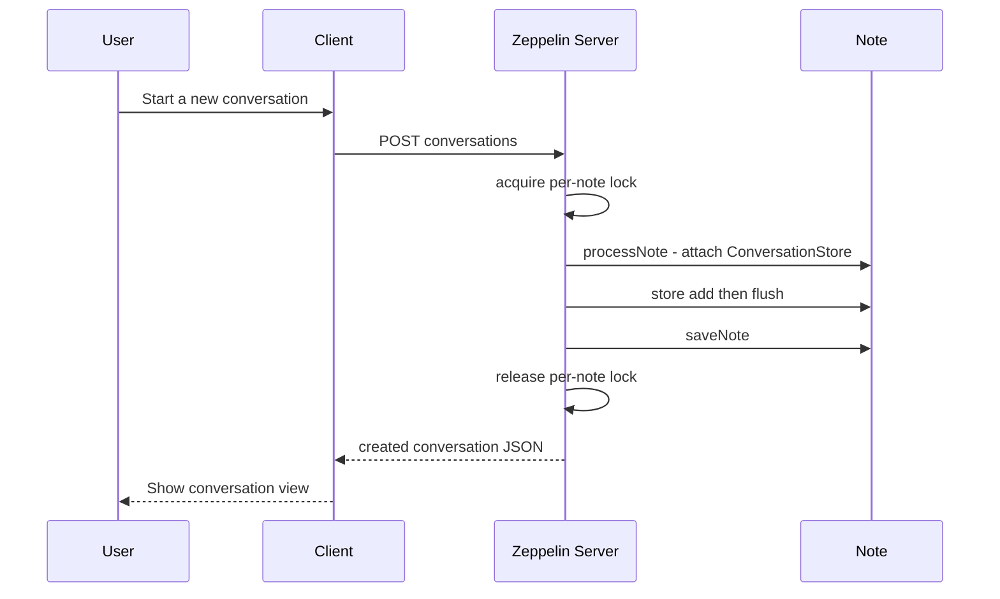
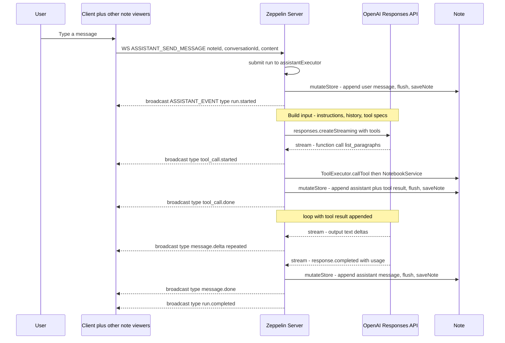
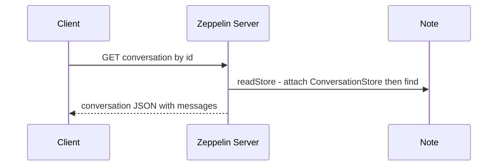

<!--
Licensed under the Apache License, Version 2.0 (the "License");
you may not use this file except in compliance with the License.
You may obtain a copy of the License at

http://www.apache.org/licenses/LICENSE-2.0
-->

# Notebook Assistant — System Sequence Design

## Overview

Per-notebook AI chat. Each notebook may host multiple conversations; conversation
data is persisted as JSON inside a hidden paragraph of the same notebook.
The LLM is OpenAI, accessed through the **Responses API** so reasoning models can
call function tools. Conversation CRUD and message history are served over REST;
sending a message and streaming the assistant's reply run over the existing
**WebSocket** (`/ws`), broadcast to every viewer of the note.

---

## Architecture

```
Browser (Angular)
    │  REST (CRUD + message history)   +   WebSocket (streaming send)
    ▼
Zeppelin Server (Java)
    ├── AssistantConversationRestApi  (REST: conversation CRUD)
    ├── AssistantMessageRestApi       (REST: message list / pagination)
    ├── NotebookServer  (WS: ASSISTANT_SEND_MESSAGE → broadcast ASSISTANT_EVENT)
    │
    └── NotebookAssistantService      (run loop, per-note locking)
          ├── ConversationStore       (hidden-paragraph domain façade)
          ├── ConversationJsonCodec   (wire format)
          ├── ToolExecutor            (tool registry: name → Tool)
          │     └── ListParagraphsTool
          └── ChatModel               (provider-neutral streaming seam)
                └── OpenAiChatModel    (OpenAI Responses API adapter)
    │
    │  OpenAI API (HTTPS, Responses API)
    ▼
OpenAI
    │
    └── function tool: list_paragraphs
    │
    ▼
Note (.zpln file)
    ├── paragraph (visible) — user code/analysis
    ├── paragraph (visible) — ...
    └── paragraph (hidden)  — assistant conversation storage
        config: { editorHide: true, tableHide: true, enabled: false, notebookAssistant: true }
        text: { "conversations": [...] }
```

The only OpenAI-coupled file is `OpenAiChatModel`. Everything else talks to the
provider-neutral `ChatModel` interface (`stream(instructions, history, tools, consumer)`),
so swapping providers means adding one adapter, not touching the service.

---

## Data Model

### Hidden paragraph payload

One hidden paragraph per notebook. Its `text` field carries the JSON below.
All field names are camelCase.

```json
{
  "conversations": [
    {
      "id": "conv_01JXXX",
      "noteId": "2F2YS7PCE",
      "title": "2F2YS7PCE 2026-09-22T10:00:00Z",
      "createdAt": "2026-09-22T10:00:00Z",
      "updatedAt": "2026-09-22T10:05:00Z",
      "messages": [
        {
          "id": "msg_01JXXX",
          "role": "user",
          "content": "Show me the paragraphs",
          "createdAt": "2026-09-22T10:00:00Z"
        },
        {
          "id": "msg_02JXXX",
          "role": "assistant",
          "content": "",
          "toolCalls": [
            {
              "id": "call_abc123",
              "name": "list_paragraphs",
              "arguments": {},
              "result": { "value": [ { "id": "20150212-145404", "title": "Load", "index": 0 } ] }
            }
          ],
          "createdAt": "2026-09-22T10:00:05Z"
        },
        {
          "id": "msg_03JXXX",
          "role": "tool",
          "toolCallId": "call_abc123",
          "content": "{\"value\":[...]}",
          "createdAt": "2026-09-22T10:00:05Z"
        },
        {
          "id": "msg_04JXXX",
          "role": "assistant",
          "content": "There is one paragraph: \"Load\".",
          "createdAt": "2026-09-22T10:00:06Z"
        }
      ]
    }
  ]
}
```

`ToolResult` is `{ "value": ... }` on success or `{ "error": "..." }` on failure
(`error == null` means success). There is no `status` field.

### Marker paragraph identification

The hidden paragraph is identified by a marker in its `config`:

```json
{
  "editorHide": true,
  "tableHide": true,
  "enabled": false,
  "notebookAssistant": true
}
```

---

## API Surface

### REST — Conversations

| Method | Path | Description |
|--------|------|-------------|
| `POST` | `/api/notes/{noteId}/conversations` | Create a conversation (title optional; defaults to `noteId + " " + now`) |
| `GET` | `/api/notes/{noteId}/conversations` | List conversations |
| `GET` | `/api/notes/{noteId}/conversations/{conversationId}` | Get a conversation (includes messages) |
| `DELETE` | `/api/notes/{noteId}/conversations/{conversationId}` | Delete a conversation |

### REST — Messages

| Method | Path | Description |
|--------|------|-------------|
| `GET` | `/api/notes/{noteId}/conversations/{conversationId}/messages?cursor=&limit=` | List messages, latest-first, cursor pagination |

Sending a message is **not** a REST call — see WebSocket below.

### WebSocket (`/ws`)

Inbound (client → server):

| OP | Payload | Description |
|----|---------|-------------|
| `ASSISTANT_SEND_MESSAGE` | `{ noteId, conversationId, content }` | Send a user message and start a run |

Outbound (server → client): a single OP carries all run events, discriminated by `type`.

```json
{
  "op": "ASSISTANT_EVENT",
  "data": {
    "conversationId": "conv_01JXXX",
    "type": "message.delta",
    "payload": { "messageId": "msg_02JXXX", "delta": "Para" }
  }
}
```

`ASSISTANT_EVENT` is **broadcast to every socket subscribed to the note** (the
same channel notebook edits use), so all viewers see the assistant reply live.
Clients route by `payload.conversationId`.

---

## Event Schema (`type` + `payload`)

| `type` | `payload` |
|--------|-----------|
| `run.started` | `{ runId, createdAt }` |
| `message.delta` | `{ messageId, delta }` |
| `message.done` | `{ messageId, content }` |
| `tool_call.started` | `{ toolCallId, name, arguments }` |
| `tool_call.done` | `{ toolCallId, result }` — `result` is a `ToolResult` |
| `run.completed` | `{ runId, usage: { inputTokens, outputTokens } }` |
| `run.failed` | `{ runId, error: { code, message } }` |

A run always ends with exactly one of `run.completed` or `run.failed`. Because
errors are delivered as `run.failed` events (there is no HTTP status over WS),
availability and permission failures are caught inside `sendMessage` and emitted
the same way.

---

## Sequence Diagrams

### 1. Create conversation (REST)

Read-modify-write is serialized by a per-note in-memory lock (`noteLocks`) held
by the service. Persistence goes through `notebook.processNote(noteId, ...)` +
`notebook.saveNote(note, subject)`.



### 2. Send message (WebSocket, with tool call)

`NotebookServer.sendAssistantMessage` submits the run to a dedicated
`assistantExecutor` (separate from the paragraph-run pool, so the WS receive
thread is never blocked and assistant load cannot starve paragraph execution)
and hands the service an `AssistantEventListener` that broadcasts each event as
an `ASSISTANT_EVENT` message.



The loop runs up to 10 iterations; if the model keeps requesting tools past that,
the service raises `IllegalStateException` and emits `run.failed`.

### 3. Get conversation (REST)



---

## Tool Implementation

### Design

Tools run **in-process** — no external MCP SDK. Each tool implements the `Tool`
interface (`name`, `description`, `parameters`, `call`), and `ToolExecutor` indexes
them by name and exposes their specs to the model. The `parameters()` map is a
JSON-Schema object handed to OpenAI as a `FunctionTool`; the same tool objects
work across providers because only `OpenAiChatModel` translates specs into the
provider's tool format.

```
NotebookAssistantService.runLoop  (tool-loop orchestration, emits events via sink)
    │
    ├── ChatModel.stream          (provider-neutral; OpenAiChatModel = Responses API)
    │
    └── ToolExecutor.callTool     (name → Tool.call) → ToolResult
             │
             ▼
        Tool (e.g. ListParagraphsTool) → NotebookService (Zeppelin core)
```

`ToolExecutor.callTool` never throws: a missing tool or a thrown exception is
captured as `new ToolResult(null, errorMessage)`.

### `Tool` interface

```java
public interface Tool {
  String name();
  String description();
  Map<String, Object> parameters();   // JSON-Schema object
  Object call(String noteId, Map<String, Object> args, ServiceContext ctx) throws IOException;
}
```

---

## Tools (LLM → Zeppelin)

Only one tool is currently registered. Descriptions are read by the model, so
they stay in English.

### `list_paragraphs`

Return the list of visible (non-marker) paragraphs in the notebook.

```json
{
  "name": "list_paragraphs",
  "description": "List the visible paragraphs of the notebook.",
  "parameters": { "type": "object", "properties": {} }
}
```

Result (`ToolResult.value`):
```json
[
  { "id": "20150212-145404", "title": "Load data", "index": 0,
    "interpreter": "python", "text": "%python\ndf = pd.read_csv(...)" },
  { "id": "20150212-145500", "title": "Visualize", "index": 1,
    "interpreter": "sql",    "text": "%sql\nSELECT ..." }
]
```

The hidden marker paragraph is excluded from the result.

---

## System Prompt (instructions)

```
You are an AI assistant integrated into Apache Zeppelin, a web-based notebook.
You are talking within the context of a single notebook.
Answer the user's questions concisely and clearly.
```

---

## Configuration

Add the following to `zeppelin-site.xml` (Zeppelin config keys use dot separators):

```xml
<!-- OpenAI API key -->
<property>
  <name>zeppelin.notebook.assistant.openai.api.key</name>
  <value></value>
</property>

<!-- Model to use (a reasoning model requiring the Responses API is fine) -->
<property>
  <name>zeppelin.notebook.assistant.openai.model</name>
  <value>gpt-...</value>
</property>

<!-- Enable the Notebook Assistant feature -->
<property>
  <name>zeppelin.notebook.assistant.enable</name>
  <value>false</value>
</property>
```

The API key is excluded from `ConfigurationService` responses so it never reaches
the frontend.

---

## Error Cases

| Condition | Result |
|-----------|--------|
| Feature disabled / API key not configured | `run.failed` (during a run); REST CRUD → 503 |
| Note not found | `run.failed`; REST → 404 |
| Conversation not found | `run.failed`; REST → 404 |
| Missing read/write permission | `run.failed`; REST → 403 |
| OpenAI / tool / save error mid-run | `run.failed` (code `internal_error`) |
| Tool loop exceeds 10 iterations | `run.failed` |

REST CRUD endpoints still map exceptions to HTTP status (JAX-RS
`WebApplicationExceptionMapper`). Over WS there is no status code, so every
failure is surfaced as a `run.failed` event carrying `{ code, message }`.

---

## Implementation Status

| Component | Status |
|-----------|--------|
| Conversation CRUD (list/create/get/delete) — REST | Done |
| `GET .../messages` (cursor pagination) — REST | Done |
| Hidden paragraph storage (`ConversationStore` + `ConversationJsonCodec`) | Done |
| Per-note lock (`noteLocks`) | Done |
| `Tool` / `ToolExecutor` / `ListParagraphsTool` | Done |
| `ChatModel` seam + `OpenAiChatModel` (Responses API, streaming) | Done |
| `sendMessage` run loop + tool dispatch | Done |
| WebSocket streaming (`ASSISTANT_SEND_MESSAGE` / `ASSISTANT_EVENT`, broadcast) | Done (backend) |
| Angular UI + WS OP enum sync | Out of scope (delivered separately) |

## Out of Scope

- Conversation title editing (may be added later)
- Additional paragraph tools (get/add/update/delete, run) — only `list_paragraphs` today
- Bidirectional run control over WS (stop / interrupt / steer)
- Concurrency within a single conversation (concurrent runs on the same
  conversation can interleave history — a pre-existing multi-user concern)
- LLM providers other than OpenAI (the `ChatModel` seam is ready, but only the
  OpenAI adapter exists)
```

